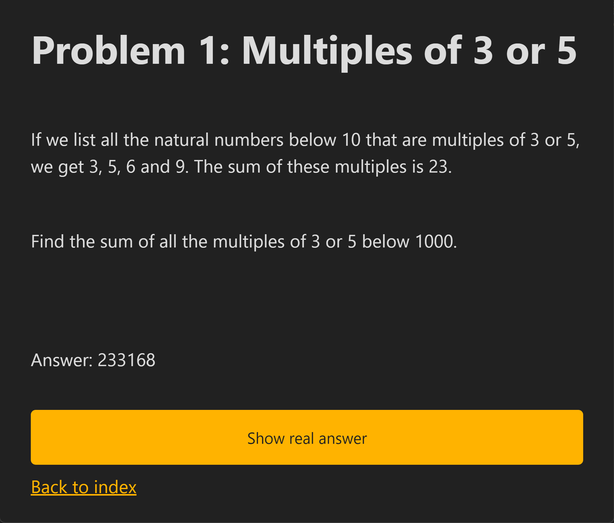

# Project Euler Starter Pack: Javascript Edition

Starter pack for [Project Euler](https://projecteuler.net/archives). Written in `Javascript`, running on `node.js`, locally hosted in an aesthetically elegant website.

<center>
  
</center>

## How to use

* Install `Node.js` and `npm`
* `git clone` the repository.

```bash
cd project-euler-js-website
npm install
node index.js
```

If you want to load more than the first 20 problems, change the line `rebuild_scripts(20);` in `index.js`.

Now open `localhost:3000` in your browser. The first loading would take a while as it generates all the `html` pages, but after that it would only regenerate the pages if you update the corresponding `js` file.

Every time you finish a `js` file in the `scripts` folder, just refresh any page, and the server would run the `js` file, get the answer, then generate the corresponding `html` file. Note that if you accidentally made an infinite loop, you're out of luck and would have to kill the server. I would have coded in an automatic time-out, but it's hard to figure out how long to wait, since some problems could take minutes to finish computing, so please just use your own judgment.

To solve a problem, go to the `scripts` folder. Replace the `0` in this function of each file:

```javascript
exports.solution = () => {
    return 0;
};
```

For example, this is in my `1.js`:
```javascript
exports.solution = () => {
    let ans = 0;
    for (let i = 1; i < 1000; i++){
        if (i % 3 === 0 || i % 5 === 0) {
            ans += i;
        }
    }
    return ans;
};
```

You can find [solutions online](https://github.com/luckytoilet/projecteuler-solutions/blob/master/Solutions.md). I don't think it's cheating to have numerical solutions. After all, you still have to code up your solutions.

## Dependencies

```json
"dependencies": {
    "axios": "^1.4.0",
    "cheerio": "^1.0.0-rc.12",
    "express": "^4.18.2",
    "handlebars": "^4.7.7"
}
```

## Credits

The CSS file used is MIT licensed from [`Simple.css` by Kev Quirk](https://github.com/kevquirk/simple.css).

The answers in `ansewrs.txt` are from [luckytoilet/projecteuler-solutions: Numerical answers to all Project Euler problems](https://github.com/luckytoilet/projecteuler-solutions).
